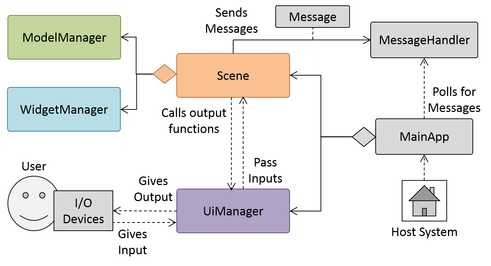
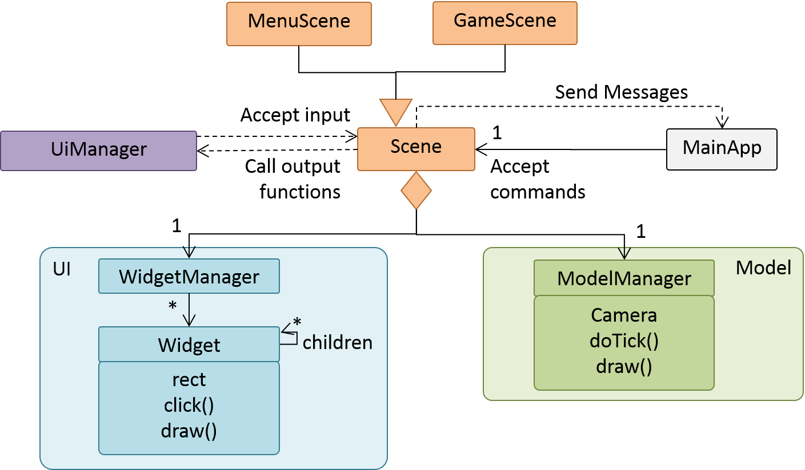

# Guide

## Setting up
### Prerequisites
- Highly recommended: Latest version of [Code::Blocks](http://www.codeblocks.org)
- gcc compiler

### Setting up the project on your computer
Windows:

- Clone this repo to your computer.
- Grab the libraries that are stated in the readme and put the .dlls in the same location as where the executable will be.
- Make sure gcc knows where to find the libraries and headers.
- Compile the source code with these options: `-lmingw32 -lSDL2main -lSDL2 -lSDL2_ttf -lSDL2_image`
	- This is already set up for you if you have Code::Blocks on your computer. Just open the .cbp project file.

### Verifying the setup
- Run the program and interact with it using the mouse and keyboard.
	- Currently, <kbd>Q</kbd> switches between the Menu and Game Scenes, as does clicking the Widget at the topleft of the screen.

## Design
### Architecture

The `MainApp` hosts all the other components, and tracks application-wide data such as frames per second (FPS). It contains methods to initialize, run and de-initialize the whole program. It also contains methods that allow `Message`s to affect its underlying data.

Independent of `MainApp` and indeed the rest of the program is the `MessageHandler`. `MessageHandler` is a singleton class which collects `Message`s posted to it by any part of the main program, and lets a `MainApp` instance clear the `Message`s.

When the whole program starts, an instance of `MainApp` is created. `init()` is called, then `run()`. `run()` executes an endless loop:

- Poll for inputs
	- `MainApp` tells `MainUiManager` to pass `Scene` raw inputs.
	- `Scene` parses the inputs into internal actions that are effected immediately, and `Message`s that are posted to `MessageHandler`.
	- `MainApp` clears all `Message`s from `MessageHandler`.
- Update
	- `MainApp` tells `Scene` to update itself by 1 tick. `Scene` may post more `Message`s.
	- `MainApp` clears `Message`s.
- Draw
	- `MainApp` tells `Scene` to draw, passing it `MainUiManager`.
	- `Scene` tells `MainUiManager` what to draw based on its `Widget`s and `Model`.

When `run()` is exited, `deinit()` is called, then the program ends.

### MainUiManager

The `MainUiManager` handles all low-level I/O, including setting up I/O functionality, maintaining I/O info, and providing an interface for the rest of the program to make I/O calls with. Specific duties include:

- Breaking down input - such as keyboard and mouse signals - to feed to `Scene`.
- Providing `Scene` an interface to make output calls to, such as display and audio.

The `MainUiManager` relies on SDL and OpenGL to perform its duties.

### Scene

The `Scene` is the core of the game. It is conceptually split into two sections: The UI and the Model. Despite this split, there is no technical barrier and they are not actual classes, as the UI section heavily reads from and writes to the Model section. The Model section may furthermore accept input and write output on its own.

There are different derivatives of `Scene`, corresponding what what environments the player might encounter while navigating the app. In particular, there is a `MenuScene` - meant to be the environment of the main menu and game lobby, and a `GameScene` - meant to be the actual game environment. The `MainApp` tracks one `Scene`, which it can construct and destruct as needed.

The Model contains the actual state of the game, as well as methods to update them. While the `GameScene` makes the heaviest use of the Model, other `Scene`s may also use the Model to display backdrops and animations.

The UI section serves two purposes: To define how input from `MainUiManager` is interpreted into actions that affect the Model, and to define how the Model is represented in terms of output to `MainUiManager`. It achieves this through the use of `Widget`s, which together build up a GUI.

#### Widgets

`Widget`s essentially define a region in screen space. They may have a defined action upon being clicked, and also have a defined draw function to visually indicate where they are when the app runs. They can be used to display information such as text, or provide a region for the player to click in order to activate a certain function. `Widget`s are fixed to the screen space; they move around with the in-game camera. `Widget`s are always drawn on top of any other object from the Model.